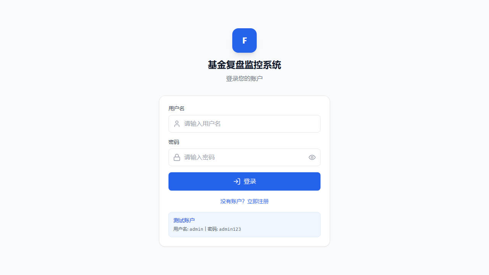

# 基金复盘监控系统

[](https://github.com/xr-susan/fund-review-monitor/actions/workflows/ci.yml)
[](LICENSE)
[](package.json)

一个面向个人投资复盘的基金观察与记录工具。项目把自选基金、净值走势、持仓分析、基准对比、复盘笔记和 CSV 导出放在同一个工作台里，适合用来沉淀自己的基金观察方法。

> 本项目仅用于学习和研究，不构成任何投资建议。基金和股票数据来自第三方公开接口，可能存在延迟、缺失或格式变化。

## 功能亮点

- 自选基金管理：搜索基金、加入/移除观察列表、查看基金详情。
- 净值与收益复盘：历史净值曲线、阶段涨跌幅、基准指数对比。
- 持仓分析：基金重仓股、行业/个股集中度、风险提示。
- 复盘笔记：记录买入/卖出理由、预期收益、止损线和执行结果。
- 用户隔离：登录后按用户保存自选列表和笔记。
- 数据导出：基金列表、持仓明细和复盘笔记可导出 CSV。
- 本地部署：React + Vite 前端，Express + SQLite 后端，支持 Docker Compose。

## 技术栈

- 前端：React 18、Vite、Tailwind CSS、Zustand、Recharts、Lucide React
- 后端：Node.js、Express、better-sqlite3、JWT、WebSocket
- 数据源：天天基金、东方财富等公开接口
- 测试：Jest、Supertest

## 快速开始

### 环境要求

- Node.js 18+
- npm 9+

### 本地开发

```bash
git clone https://github.com/xr-susan/fund-review-monitor.git
cd fund-review-monitor
npm run install:all
```

复制环境变量示例：

```bash
cp backend/.env.example backend/.env
cp frontend/.env.example frontend/.env
```

启动后端：

```bash
npm run dev:backend
```

启动前端：

```bash
npm run dev:frontend
```

访问：

- 前端：http://localhost:3001
- 后端健康检查：http://localhost:5000/api/health

默认管理员账号用于本地体验：

- 用户名：`admin`
- 密码：`admin123`

部署或公开访问前，请修改 `backend/.env` 中的 `ADMIN_PASSWORD` 和 `JWT_SECRET`。

## 界面预览

目前仓库里只有登录页的截图：



其余页面尚未截图。下表列出值得补充的页面与建议的文件名，截图请自行运行项目后手动采集，统一放在 `docs/screenshots/` 目录下。

| 页面 | 建议文件名 | 内容说明 | 状态 |
| --- | --- | --- | --- |
| 登录页 | `docs/screenshots/login.png` | 登录表单与测试账户提示 | 已提供 |
| 仪表板 | `docs/screenshots/dashboard.png` | 核心指标卡片、基准指数、净值走势与涨跌排行 | 待补充 |
| 基金监控 | `docs/screenshots/fund-monitor.png` | 自选基金列表、搜索与添加 | 待补充 |
| 持仓分析 | `docs/screenshots/holdings-analysis.png` | 重仓股、集中度与风险提示 | 待补充 |
| 投资组合 | `docs/screenshots/portfolio-analysis.png` | 组合结构分析与持仓金额设置 | 待补充 |
| 对标分析 | `docs/screenshots/benchmark-compare.png` | 基金与基准指数对比 | 待补充 |
| 收益计算器 | `docs/screenshots/return-calculator.png` | 收益与持有周期试算 | 待补充 |
| 复盘笔记 | `docs/screenshots/notes-center.png` | 买卖理由、预期收益与执行结果记录 | 待补充 |
| 预警设置 | `docs/screenshots/alert-settings.png` | 告警规则与通知渠道配置 | 待补充 |

> 采集方式：本地启动前后端（`npm run dev:backend` + `npm run dev:frontend`），访问 http://localhost:3001 并使用默认管理员账号登录后逐页截图。为避免泄露个人持仓数据，建议使用演示账号或清空自选列表后再截图。

更多演示方式见 [docs/demo.md](docs/demo.md)。

### Docker Compose

```bash
cp .env.example .env
docker compose up --build
```

访问 http://localhost:3000。

## 常用命令

```bash
npm run install:all      # 安装前后端依赖
npm test                 # 运行后端测试
npm run test:frontend    # 运行前端组件测试
npm run test:e2e         # 运行前端 Playwright 端到端测试
npm run build            # 构建前端
npm run dev:backend      # 启动后端开发服务
npm run dev:frontend     # 启动前端开发服务
```

## API 概览

| 方法 | 路径 | 说明 |
| --- | --- | --- |
| POST | `/api/auth/login` | 登录 |
| POST | `/api/auth/register` | 注册 |
| GET | `/api/funds/search?keyword=xxx` | 搜索基金 |
| GET | `/api/funds` | 获取自选基金 |
| POST | `/api/funds/watchlist` | 添加自选基金 |
| DELETE | `/api/funds/watchlist/:code` | 删除自选基金 |
| GET | `/api/funds/:code` | 获取基金详情 |
| GET | `/api/funds/:code/holdings` | 获取基金持仓 |
| GET | `/api/funds/:code/nav-history` | 获取历史净值 |
| GET | `/api/benchmark` | 获取基准指数 |
| GET | `/api/notes` | 获取复盘笔记 |
| POST | `/api/notes` | 创建复盘笔记 |
| GET | `/api/export/funds` | 导出基金数据 |
| GET | `/api/health` | 健康检查 |

## 项目结构

```text
fund-review-monitor/
  backend/      Express API, SQLite database, auth, cache, tests
  frontend/     React app, pages, components, API services, Playwright e2e
  docs/         架构说明与演示文档
  .github/      CI workflow
```

架构细节（请求链路、认证流程、缓存与数据源降级、数据库表结构、WebSocket 协议）见 [docs/ARCHITECTURE.md](docs/ARCHITECTURE.md)。

## 路线图

- 扩展更多前端组件测试和关键业务端到端测试。
- 继续补充数据源降级策略，减少第三方接口波动的影响。
- 将告警规则和通知模板持久化到用户配置。
- 增加公开在线演示环境和更多功能截图。

## 贡献

欢迎提交 Issue 或 Pull Request。建议先阅读 [CONTRIBUTING.md](CONTRIBUTING.md)。

## License

[MIT](LICENSE)
