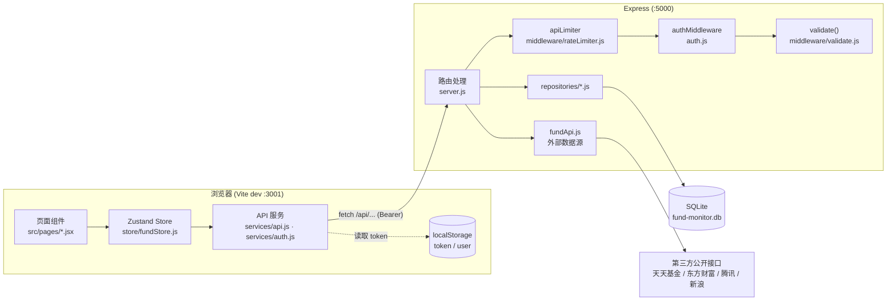
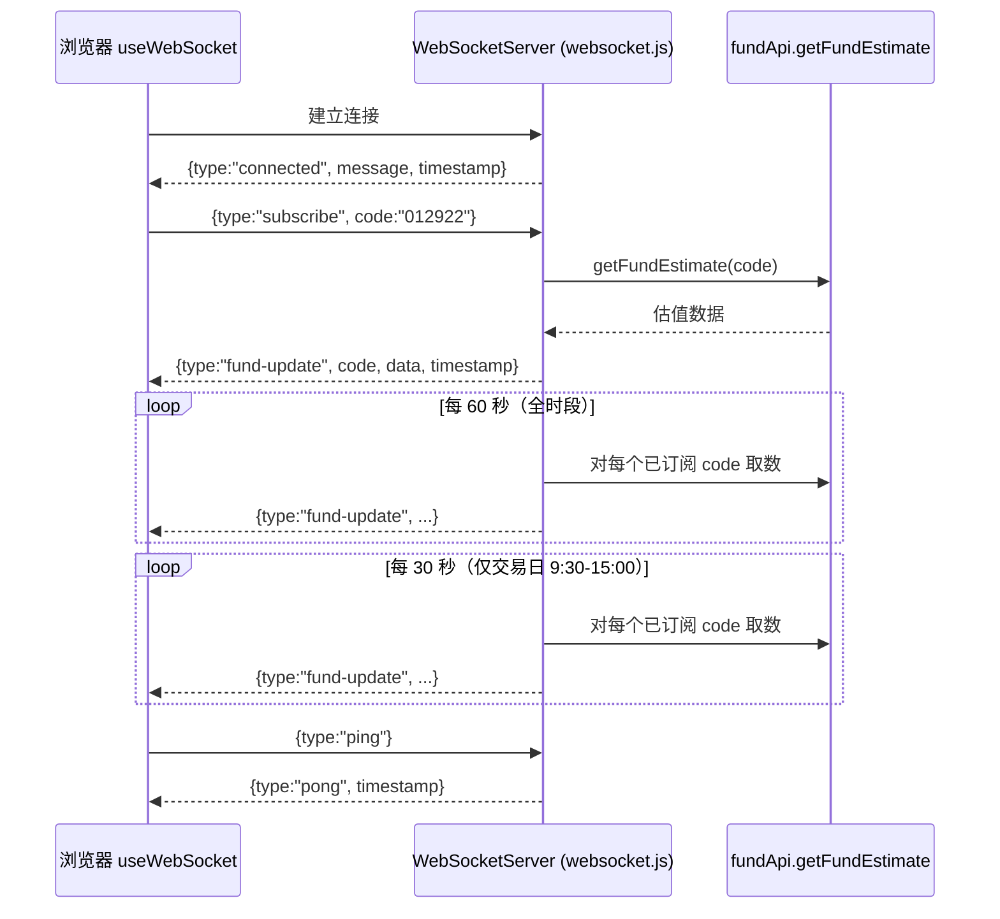
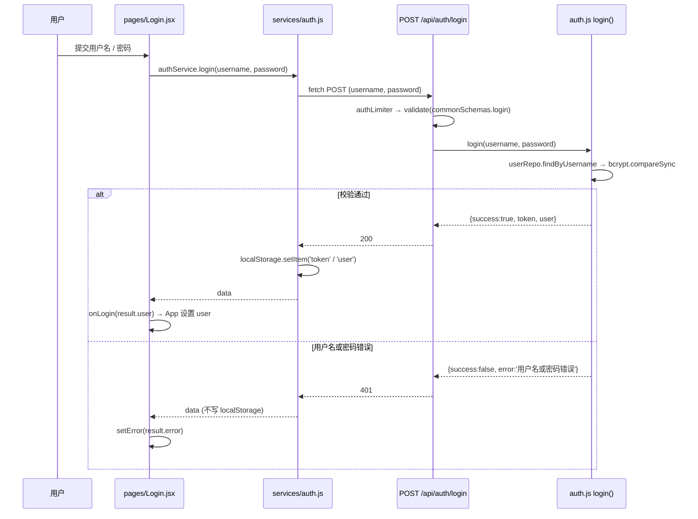
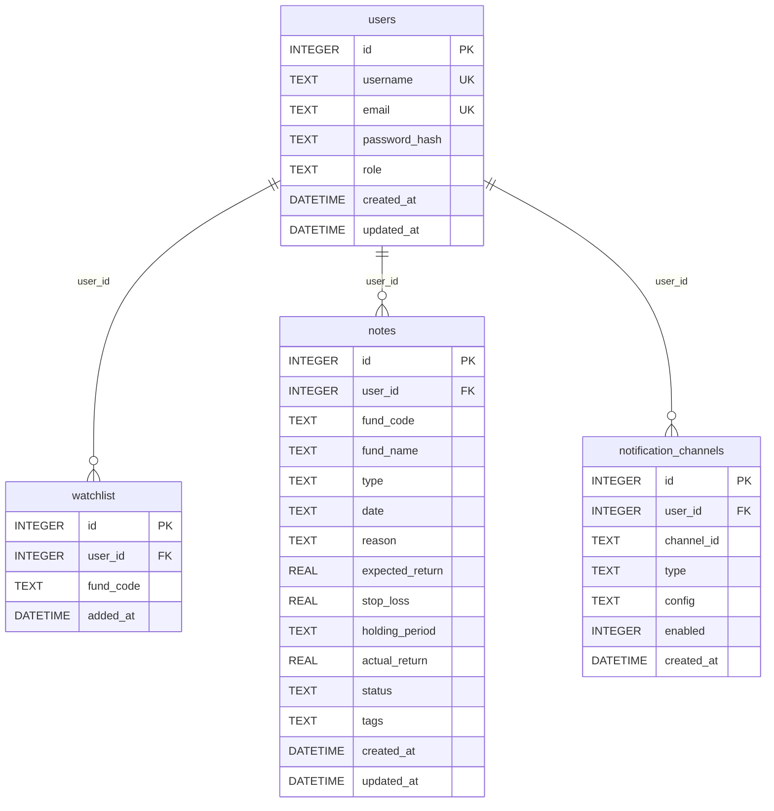

# 架构说明

本文档描述「基金复盘监控系统」的实际实现结构，内容全部来自代码本身，并标注了对应的源文件。阅读顺序建议：先看整体请求链路，再看认证、缓存与数据源降级，最后看数据库表结构与 WebSocket 协议。

> 说明：本文档只描述现状，不包含改进建议。末尾「已知限制」一节记录的是从代码中可以确认的真实约束。

---

## 1. 整体架构

系统是一个前后端分离的单体应用：

- **前端**：React 18 + Vite（开发端口 `3001`），通过 Vite 的 `/api` 代理把请求转发到后端。
- **后端**：Express（端口 `5000`，`backend/server.js:50`），同时承载 HTTP API 与 WebSocket（共用同一个 HTTP server，`backend/server.js:64-67`）。
- **存储**：better-sqlite3，单文件数据库，默认位于 `backend/data/fund-monitor.db`（`backend/database.js:10`）。
- **外部数据源**：天天基金 / 东方财富 / 腾讯财经 / 新浪财经的公开接口，由 `backend/services/fundApi.js` 统一封装。

### 1.1 HTTP 请求链路

要点：

- 页面不直接发请求，统一经由 `frontend/src/store/fundStore.js` 调用 `frontend/src/services/api.js`。
- `api.js` 的 `request()` 每次从 `localStorage.getItem('token')` 取令牌并拼成 `Authorization: Bearer <token>`（`frontend/src/services/api.js:8-11`）。
- 所有 `/api/` 请求先经过 `apiLimiter`（`backend/server.js:57`），再按路由决定是否叠加 `authMiddleware` / `validate()`。

### 1.2 WebSocket 推送链路

WebSocket 服务通过 `setupWebSocket(server)` 挂载到同一个 HTTP server 上（`backend/server.js:67`、`backend/websocket.js:8`），因此与 HTTP 共用 `5000` 端口，没有独立端口。

### 1.3 页面切换方式（无路由库）

前端**没有使用 react-router**。`frontend/src/App.jsx:22` 用 `useState('dashboard')` 保存当前页面，`Sidebar` / `MobileBottomNav` 通过回调 `setCurrentPage(id)` 切换，`App.jsx:121-148` 的 `switch` 决定渲染哪个页面组件。因此：

- 不存在 URL 级别的路由，页面状态不会反映到地址栏。
- 所谓「受保护路由」实际是 `App.jsx:106-109` 的渲染级判断：`user` 为空时整棵应用树被替换为 `<Login />`。

`App.jsx:12-19` 对 8 个业务页面使用 `React.lazy` 做代码分割，`Login` 为同步引入。

---

## 2. 模块职责

### 2.1 后端 `backend/`

| 路径 | 职责 |
| --- | --- |
| `server.js` | 应用入口。装配 CORS / JSON 中间件、限流、全部 HTTP 路由、cron 定时任务、404 与全局错误处理，并创建 HTTP server 与 WebSocket。 |
| `database.js` | 打开 SQLite 连接、设置 `journal_mode = WAL` 与 `foreign_keys = ON`、执行建表语句（`initDatabase()`）。导出 `db` 单例。 |
| `auth.js` | JWT 签发/校验（`generateToken` / `verifyToken`）、bcrypt 密码哈希与校验、`register` / `login` / `updateUser`、`authMiddleware`、`requireRole`、`refreshToken`、默认管理员初始化。 |
| `cache.js` | 内存缓存 `MemoryCache` 类与四个实例（`fundCache` / `stockCache` / `holdingsCache` / `navHistoryCache`），以及 `clearFundCache` / `clearAllCache`。 |
| `websocket.js` | 基于 `ws` 的推送服务：连接管理、订阅表、单播与广播、心跳、定时广播；另导出 `broadcastMessage`。 |
| `notifications.js` | 通知渠道注册表 `notificationManager`、默认告警规则 `DEFAULT_ALERT_RULES`、通知模板与渲染函数（`renderTemplate` / `buildAlert`）。 |
| `services/fundApi.js` | 全部第三方数据源访问与解析，以及「多数据源依次降级」工具 `requestFirstAvailable`。 |
| `repositories/` | 数据访问层，直接持有 `db` 并执行预编译 SQL：`userRepo.js`、`watchlistRepo.js`、`noteRepo.js`。 |
| `middleware/` | `rateLimiter.js`（内存限流）、`validate.js`（输入清洗 + 参数校验 + `commonSchemas`）、`errorHandler.js`（`AppError`、`ErrorCode`、全局错误与 404 处理）。 |
| `tests/` | Jest + Supertest 测试：`auth.test.js`、`database.test.js`、`fallback.test.js`、`notifications.test.js`，公共夹具在 `setup.js`（使用 `:memory:` 数据库）。 |

### 2.2 前端 `frontend/src/`

| 路径 | 职责 |
| --- | --- |
| `App.jsx` | 应用外壳：登录态检查、页面状态与切换、数据初始化与定时刷新、暗色模式、登出。 |
| `main.jsx` | 挂载 React 根节点，外层包 `ErrorBoundary`。 |
| `pages/` | 页面组件。共 9 个文件：`Login.jsx` 为同步引入，其余 8 个（`Dashboard` / `FundMonitor` / `HoldingsAnalysis` / `PortfolioAnalysis` / `BenchmarkCompare` / `ReturnCalculator` / `NotesCenter` / `AlertSettings`）为懒加载；另有 `Login.test.jsx`。 |
| `components/` | 通用 UI 与图表组件，共 17 个组件 + 1 个测试（`Header`、`Sidebar`、`MobileBottomNav`、`Toast`、`ExportModal`、`StatCard`、`ErrorBoundary`、`InstallPrompt`、各类 Recharts 图表等）。 |
| `services/api.js` | 无状态 HTTP 封装：`request()` 统一处理鉴权头、401、错误消息与网络异常；导出 `fundApi` / `stockApi` / `benchmarkApi` / `notesApi` / `exportApi` / `notificationApi` / `healthApi`，并负责笔记字段 snake_case ↔ camelCase 转换。 |
| `services/auth.js` | 认证相关：`login` / `register` / `logout` / `getCurrentUser` / `getToken` / `isAuthenticated` / `getProfile` / `updateProfile` / `refreshToken` / `authenticatedFetch`；负责 localStorage 读写与 JWT 解析。 |
| `store/fundStore.js` | Zustand 全局状态：基金列表、笔记、基准指数、选中基金、暗色模式、刷新间隔、持仓金额/日期（按用户名隔离存入 localStorage），以及加载与增删改查动作和派生计算（总资产、加权涨跌）。 |
| `store/toastStore.js` | 轻提示状态。 |
| `hooks/useWebSocket.js` | `useWebSocket(url)` 管理连接、自动重连、订阅回调、心跳；`useFundRealtime(fundCode)` 在其上做单只基金订阅。 |
| `utils/` | `formatters.js`（格式化）、`indicators.js`（技术指标计算）。 |

---

## 3. 认证流程

### 3.1 签发与校验

- 密钥：`JWT_SECRET` 环境变量；测试环境回退为 `test-secret-key`，其他环境回退为 `dev-only-change-me`；生产环境若未设置则在启动时直接抛错（`backend/auth.js:6-11`）。
- 载荷：`{ id, username, role }`，有效期固定 `7d`（`backend/auth.js:7`、`backend/auth.js:32-42`）。
- 密码：bcryptjs，cost 为 10（`backend/auth.js:24`、`backend/auth.js:70`、`backend/auth.js:99`）。
- 默认管理员：`initDefaultUser()` 在库中不存在该用户名时创建 `admin / admin123 / admin@example.com`，角色 `admin`；可通过 `ADMIN_USERNAME` / `ADMIN_PASSWORD` / `ADMIN_EMAIL` 覆盖，或设置 `DISABLE_DEFAULT_ADMIN=true` 跳过（`backend/auth.js:16-27`、`backend/server.js:61`）。

### 3.2 登录时序

注意：`authService.login` 对 401 与 200 都执行 `response.json()`，仅在 `response.ok && data.success` 时才写入 localStorage（`frontend/src/services/auth.js:44-59`），所以失败时令牌不会被持久化。

### 3.3 令牌的客户端存储

| 键 | 内容 | 写入位置 | 清除位置 |
| --- | --- | --- | --- |
| `token` | JWT 字符串 | `services/auth.js` 的 `login` / `register` / `refreshToken` | `logout()`、`getCurrentUser()` 解析失败时、`api.js` 收到 401 时 |
| `user` | 用户对象 JSON（`id` / `username` / `email` / `role`） | 同上 | 同上 |

- 登录态判断以 `user` 为准：`App.jsx:39` 调用 `authService.getCurrentUser()`，读到即视为已登录。
- `App.jsx:54-61` 在 `user` 存在时触发 `loadFunds()` / `loadBenchmark()` / `loadNotes()`。
- `App.jsx:64-71` 按 `refreshInterval`（默认 5 分钟，`store/fundStore.js:63`）定时 `refreshData()`。

### 3.4 受保护路由与服务端鉴权

**服务端**：`authMiddleware`（`backend/auth.js:181-197`）要求请求头为 `Authorization: Bearer <token>`，缺失或格式不符返回 `401 {error:'未提供认证令牌'}`，校验失败返回 `401 {error:'令牌无效或已过期'}`，通过后把解码结果写入 `req.user`。

`requireRole(...roles)`（`backend/auth.js:202-214`）在其后使用：无 `req.user` 返回 401，角色不匹配返回 `403 {error:'权限不足'}`。目前用于两处：`GET /api/auth/users` 与 `DELETE /api/cache/all`，均要求 `admin`。

使用 `authMiddleware` 的路由包括：`/api/auth/me`、`/api/auth/profile`、`/api/auth/users`、`/api/auth/refresh`、`/api/funds`、`/api/funds/watchlist`（GET/POST/DELETE）、`/api/notes`（全部）、`/api/export/*`、`/api/cache/*`、`/api/notifications/*`。基金详情、持仓、历史净值、股票价格、`/api/benchmark`、`/api/health` 为公开接口。

**前端**：没有路由级守卫。`App.jsx:106-109` 在 `user` 为 `null` 时直接返回 `<Login />`，因此未登录时任何页面（含 `/dashboard` 这类深链接）都会渲染登录页。

**401 处理**：`services/api.js:28-33` 在收到 401 时删除 `token` 与 `user` 并跳转 `/`；`services/auth.js:189-237` 的 `authenticatedFetch` 在请求前用 `isTokenExpiringSoon()` 判断令牌是否将在 5 分钟内过期，若过期则先调 `POST /api/auth/refresh` 换新令牌（并用 `refreshQueue` 合并并发刷新），刷新失败则登出并跳转 `/login`。

---

## 4. 缓存层与数据源降级

### 4.1 内存缓存

`backend/cache.js` 中的 `MemoryCache` 是一个基于 `Map` 的进程内缓存：

- 每个条目记录 `{value, expiresAt, createdAt}`；`get()` 命中过期条目时删除并返回 `null`。
- 写入时若 `size >= maxSize`，删除**最早插入**的键（不是最久未访问，`cache.js:25-28`）。
- 构造时启动 `setInterval(cleanup, checkInterval)`，默认每 60 秒清理一次过期条目。
- 缓存仅存在于当前进程，重启即丢失，多进程/多实例之间不共享。

四个实例及其配置（`backend/cache.js:138-156`）：

| 实例 | maxSize | defaultTTL |
| --- | --- | --- |
| `fundCache` | 500 | 5 分钟 |
| `stockCache` | 1000 | 1 分钟 |
| `holdingsCache` | 100 | 30 分钟 |
| `navHistoryCache` | 200 | 1 小时 |

### 4.2 实际使用的缓存键与 TTL

`defaultTTL` 只在调用 `set()` 时未显式传 TTL 才生效。代码中实际显式指定的 TTL 如下：

| 缓存键 | 使用的实例 | 实际 TTL | 位置 |
| --- | --- | --- | --- |
| `funds:{userId}` | `fundCache` | 1 分钟 | `server.js:327` |
| `fund:{code}` | `fundCache` | 2 分钟 | `server.js:277` |
| `holdings:{code}` | `holdingsCache` | 30 分钟 | `server.js:487` |
| `benchmark` | `fundCache` | 2 分钟 | `server.js:536` |

失效策略：

- 新增/删除自选基金后，只删除该用户的列表缓存 `funds:{userId}`（`server.js:366`、`server.js:383`）。
- `DELETE /api/cache/funds/:code` 调用 `clearFundCache(code)`，删除 `fund:{code}`、`holdings:{code}`、`nav:{code}`（`cache.js:190-194`）。
- `DELETE /api/cache/all`（需 `admin`）调用 `clearAllCache()`，清空四个实例（`cache.js:199-204`）。
- `GET /api/cache/stats` 与 `GET /api/health` 返回四个实例的 `getStats()`（`size` / `maxSize` / `defaultTTL`）。

### 4.3 第三方数据源降级策略

降级由 `requestFirstAvailable(providers, options)` 统一实现（`backend/services/fundApi.js:7-38`）：按数组顺序依次调用 `provider.fetch()`，第一个通过 `isValid` 校验的结果被立即返回；每个失败或空结果的提供者都会被记入 `errors`；全部失败时返回 `{ data: defaultValue, provider: null, errors }`。默认 `isValid` 为「非 `null`/`undefined`」。

各数据函数的实际降级顺序：

| 函数 | 主数据源 | 降级 / 兜底 | 失败返回值 |
| --- | --- | --- | --- |
| `getFundEstimate(code)` | `fundgz.1234567.com.cn/js/{code}.js`（JSONP，解析 `dwjz`/`gsz`/`gszzl`/`jzrq`/`gztime`/`jzzl`） | 捕获任意异常后调用 `getFundNavHistory(code, 1)`，用最新一条净值构造估值对象，并打标 `dataSource: 'nav-history-fallback'`；`estimateChange` 取 `latest.change \|\| 0` | 无历史数据时 `null` |
| `getFundNavHistory(code, pageSize=30)` | `fund.eastmoney.com/pingzhongdata/{code}.js`，正则提取 `Data_netWorthTrend` 后 `slice(-pageSize)` | 无降级 | `[]` |
| `getFundDetail(code)` | `fund.eastmoney.com/pingzhongdata/{code}.js`，正则提取 `fS_name` / `fS_code` / `Data_currentFundManager[0].name` / `stockCodes` | 无降级（基金经理解析失败时静默留空） | `null` |
| `getFundHoldings(code)` | `fundf10.eastmoney.com/FundArchivesDatas.aspx`（`type=jjcc&topline=10`），解析首个 HTML 表格，最多 10 行，占比取第 7 列 | 无降级 | `[]` |
| `getStockPrice(code)` | `requestFirstAvailable`：[1] `eastmoney-stock` → [2] `sina-stock` | 见下 | `null` |
| `getIndexQuote(indexCode)` | `requestFirstAvailable`：[1] `tencent-index` → [2] `eastmoney-index` | 见下 | `null` |
| `searchFund(keyword)` | `requestFirstAvailable`：[1] `eastmoney-suggest`（`fundsuggest.eastmoney.com`）→ [2] `eastmoney-fundcode`（`fund.eastmoney.com/js/fundcode_search.js` 本地过滤，最多 20 条） | `isValid` 要求非空数组，`defaultValue: []` | `[]` |
| `getBatchIndexQuotes()` | 并行调用 `getIndexQuote` 取沪深300 / 中证500 / 创业板指 | 单只失败时返回 `{name, code, change: 0, yearChange: 0}`（无 `price` 字段） | 始终返回三键对象 |

股票价格的两级降级细节：

- `getEastmoneyStockPrice`：按代码形态生成候选 `secid` 列表并逐个尝试——5 位数字视为港股（`116.` / `128.`，价格除数 `10000`），纯字母视为美股（`105.` / `106.` / `107.`，除数 `1000`），其余按 `6` 开头映射沪市 `1.`、否则深市 `0.`（除数 `100`）。全部候选失败才抛错，交由 `requestFirstAvailable` 切换到新浪。
- `getSinaStockPrice`：`hq.sinajs.cn/list=sh|sz{code}`，要求字段数 ≥ 32，`pe` / `pb` 固定为 `null`（新浪接口不提供）。

其他相关行为：

- 所有 axios 请求都设 `timeout: 10000`，并带 `Referer` 与桌面版 `User-Agent` 头。
- `getBatchStockPrices(codes)` 使用 `Promise.allSettled` 并过滤掉 rejected / `null` 结果，**不使用缓存、也不限制并发**，即每只股票各发一次请求。
- 指数年涨跌幅使用**硬编码的年初点位**（沪深300 `3900`、中证500 `5500`、创业板指 `2100`）反推，见 `fundApi.js:568-573` 与 `fundApi.js:613-617`。

### 4.4 定时任务与 WebSocket 的取数

- `backend/server.js:880-907`：`node-cron` 表达式 `*/5 * * * *`，但函数内部再判断是否为工作日 9:30–15:00；满足条件时对 `watchlistRepo.findAllFundCodes()` 的每只基金调用 `getFundEstimate`，结果写入 `server.js` 内的局部 `cache.funds` 对象。
- `backend/websocket.js:148-161`：每 60 秒无条件广播一次；另有每 30 秒的定时器，仅在交易日 9:30–15:00 触发广播。两次广播都对每个已订阅代码调用一次 `getFundEstimate`。

---

## 5. 数据库结构

数据库为单文件 SQLite，建表语句集中在 `backend/database.js:22-72`，列名与仓库层实际读写保持一致。以下表结构均来自该处。

### 5.1 `users`

| 列 | 类型 | 约束 | 说明 |
| --- | --- | --- | --- |
| `id` | INTEGER | PRIMARY KEY AUTOINCREMENT | 用户 ID |
| `username` | TEXT | UNIQUE NOT NULL | 登录名 |
| `email` | TEXT | UNIQUE NOT NULL | 邮箱 |
| `password_hash` | TEXT | NOT NULL | bcrypt 哈希（cost 10） |
| `role` | TEXT | DEFAULT `'user'` | `user` 或 `admin` |
| `created_at` | DATETIME | DEFAULT CURRENT_TIMESTAMP | |
| `updated_at` | DATETIME | DEFAULT CURRENT_TIMESTAMP | 更新时由 `userRepo.update` 显式写入 |

读写方：`backend/repositories/userRepo.js`（`findById` / `findByUsername` / `findByEmail` / `create` / `update` / `findAll`）。`findAll` 只返回 `id, username, email, role, created_at`，不返回密码哈希。

### 5.2 `watchlist`

| 列 | 类型 | 约束 | 说明 |
| --- | --- | --- | --- |
| `id` | INTEGER | PRIMARY KEY AUTOINCREMENT | |
| `user_id` | INTEGER | NOT NULL, FOREIGN KEY → `users(id)` | 所属用户 |
| `fund_code` | TEXT | NOT NULL | 6 位基金代码 |
| `added_at` | DATETIME | DEFAULT CURRENT_TIMESTAMP | 加入时间 |

表级约束：`UNIQUE(user_id, fund_code)`。读写方：`backend/repositories/watchlistRepo.js`。`findByUserId` 只 `SELECT fund_code, added_at`（不返回 `id`），按 `added_at DESC` 排序；`add` 捕获 UNIQUE 冲突并返回 `false`；`findAllFundCodes` 用 `SELECT DISTINCT fund_code` 供定时任务与广播使用。

### 5.3 `notes`

| 列 | 类型 | 约束 | 说明 |
| --- | --- | --- | --- |
| `id` | INTEGER | PRIMARY KEY AUTOINCREMENT | |
| `user_id` | INTEGER | NOT NULL, FOREIGN KEY → `users(id)` | 所属用户 |
| `fund_code` | TEXT | NOT NULL | 基金代码 |
| `fund_name` | TEXT | | 基金名称 |
| `type` | TEXT | NOT NULL | `buy` / `sell` |
| `date` | TEXT | NOT NULL | `YYYY-MM-DD` |
| `reason` | TEXT | | 操作理由 |
| `expected_return` | REAL | | 预期收益 |
| `stop_loss` | REAL | | 止损线 |
| `holding_period` | TEXT | | 持有周期 |
| `actual_return` | REAL | | 实际收益 |
| `status` | TEXT | DEFAULT `'holding'` | 状态 |
| `tags` | TEXT | | **JSON 字符串**数组，读写时由 `noteRepo` 做 `JSON.stringify` / `JSON.parse` |
| `created_at` | DATETIME | DEFAULT CURRENT_TIMESTAMP | |
| `updated_at` | DATETIME | DEFAULT CURRENT_TIMESTAMP | 更新时由 `noteRepo.update` 显式写入 |

读写方：`backend/repositories/noteRepo.js`。`create` 接收 camelCase 入参（`fundCode` / `expectedReturn` 等）并映射到 snake_case 列。

### 5.4 `notification_channels`

| 列 | 类型 | 约束 | 说明 |
| --- | --- | --- | --- |
| `id` | INTEGER | PRIMARY KEY AUTOINCREMENT | |
| `user_id` | INTEGER | NOT NULL, FOREIGN KEY → `users(id)` | 所属用户 |
| `channel_id` | TEXT | NOT NULL | 渠道标识 |
| `type` | TEXT | NOT NULL | 渠道类型 |
| `config` | TEXT | NOT NULL | 配置（序列化字符串） |
| `enabled` | INTEGER | DEFAULT 1 | 是否启用 |
| `created_at` | DATETIME | DEFAULT CURRENT_TIMESTAMP | |

表级约束：`UNIQUE(user_id, channel_id)`。

### 5.5 关系图

连接级 PRAGMA：`journal_mode = WAL`、`foreign_keys = ON`（`backend/database.js:15-16`）。数据库路径优先取 `DATABASE_PATH`，否则取 `DATA_DIR`（默认 `backend/data`）下的 `fund-monitor.db`。

---

## 6. WebSocket 消息协议

协议定义在 `backend/websocket.js`，客户端实现在 `frontend/src/hooks/useWebSocket.js`。消息体均为 JSON 文本。

### 6.1 客户端 → 服务端

| `type` | 附加字段 | 服务端行为 |
| --- | --- | --- |
| `subscribe` | `code` | 把该连接加入 `subscriptions[code]`，并立即推送一次 `fund-update`（`websocket.js:59-61`、`websocket.js:80-90`） |
| `unsubscribe` | `code` | 从 `subscriptions[code]` 移除该连接，集合为空时删除该键（`websocket.js:64-66`、`websocket.js:93-101`） |
| `ping` | 无 | 立即回复 `{type:'pong', timestamp: Date.now()}`（`websocket.js:69-72`） |

未识别的 `type` 仅打印日志，不做响应（`websocket.js:74-76`）。

### 6.2 服务端 → 客户端

| `type` | 载荷 | 触发时机 |
| --- | --- | --- |
| `connected` | `{ type, message: '连接成功', timestamp: ISO 字符串 }` | 连接建立后立即发送（`websocket.js:21-25`） |
| `fund-update` | `{ type, code: string, data: <getFundEstimate 的返回值>, timestamp: ISO 字符串 }` | 订阅成功时立即发送一次；之后由广播定时器发送（`websocket.js:108-113`、`websocket.js:128-133`） |
| `pong` | `{ type, timestamp: 毫秒时间戳（数字） }` | 收到 `ping` 时（`websocket.js:71`） |

注意两处不一致：`pong` 的 `timestamp` 是数字（`Date.now()`），而 `connected` / `fund-update` 的是 ISO 字符串；`fund-update` 的 `data` 是**裸的估值对象**，外面没有再包一层 `type` 字段。

### 6.3 连接地址与客户端行为

- 地址：`useWebSocket(url)` 优先用传入的 `url`，否则用 `import.meta.env.VITE_WS_URL`，最后回退 `ws://${window.location.hostname}:5000`（`hooks/useWebSocket.js:7`）。
- `onopen`：把 `subscribers` 中已有的全部 `code` 重新订阅一遍（`hooks/useWebSocket.js:25-28`）。
- `onmessage`：解析后写入 `lastMessage`；若 `type === 'fund-update'` 且该 `code` 在本地订阅表中，则以 `data.data` 调用对应回调（`hooks/useWebSocket.js:36-40`）。
- `onclose`：5 秒后自动重连（`hooks/useWebSocket.js:46-55`）。
- 心跳：每 30 秒发送一次 `{type:'ping'}`（`hooks/useWebSocket.js:104-112`）。
- `useFundRealtime(fundCode)` 在 `connected` 为真且 `fundCode` 非空时订阅，返回 `{ data, loading, connected }`，卸载时 `unsubscribe`。

### 6.4 广播节奏

| 定时器 | 周期 | 条件 |
| --- | --- | --- |
| 全时段广播 | 60 秒 | 无（`websocket.js:148`） |
| 交易时段广播 | 30 秒 | 仅周一至周五 9:30–15:00（`websocket.js:151-161`） |

每次广播都会对**每个已订阅的基金代码**调用一次 `getFundEstimate(code)`，再推给该代码的所有订阅者。

---

## 7. 已知限制

以下均为阅读代码后可确认的现状，非推测。

### 7.1 存储与进程

- **SQLite 单进程**：`better-sqlite3` 为同步驱动，`database.js` 只导出单个 `db` 连接；WAL 模式提升并发读，但写入仍受单文件锁限制，无法横向扩展多实例。
- **缓存是进程内的**：`cache.js` 使用 `Map`，重启即失效，多实例之间不共享。`cacheMiddleware` 虽已导出但**从未被任何路由注册使用**。
- **两个缓存实例实际未被写入**：`stockCache` 与 `navHistoryCache` 只出现在 `getStats()` / `clear()` 调用中，代码里没有任何 `stockCache.set(...)` 或 `navHistoryCache.set(...)`；因此 `clearFundCache` 里的 `navHistoryCache.delete('nav:'+code)` 实际是空操作。
- **`notification_channels` 表未被使用**：该表在 `database.js` 中创建，但仓库层没有任何文件引用它（通知渠道由内存中的 `notificationManager` 管理），且 `backend/tests/setup.js` 的测试库也未创建该表。
- **定时任务写入的是局部对象**：`server.js:880-907` 的 cron 把结果写进 `server.js` 内的局部 `cache.funds`，而 API 读取的是 `cache.js` 的 `fundCache`，两者不是同一个对象。

### 7.2 第三方接口

- **强依赖公开爬取接口**：全部行情来自天天基金 / 东方财富 / 腾讯 / 新浪的公开端点，无官方 SLA，接口字段或返回格式变化会导致解析失败（多处解析用正则匹配 JS 文件内容）。
- **限流与延迟**：单请求超时 10 秒；`getBatchStockPrices` 对每只股票各发一次请求且不缓存、不限制并发，持仓股较多时会同时打开大量连接；`authLimiter` 为 10 次/15 分钟，登录失败重试次数很有限。
- **降级不覆盖所有函数**：只有 `getFundEstimate`（退到历史净值）、`getStockPrice`、`getIndexQuote`、`searchFund` 具备多源/兜底逻辑；`getFundNavHistory`、`getFundDetail`、`getFundHoldings` 失败即返回 `[]` 或 `null`。
- **指数年涨跌幅为硬编码基准**：年初点位写死在代码里（3900 / 5500 / 2100），跨年后不会自动更新。

### 7.3 认证与会话

- **令牌无法自动续期**：`POST /api/auth/refresh` 自身挂了 `authMiddleware`，而 `authMiddleware` 会拒绝已过期令牌，因此前端在令牌真正过期后调用刷新会得到 401，只能重新登录。
- **`refreshToken()` 用 `decode` 而非 `verify`**：`auth.js:229` 使用 `jwt.decode(token)`，只解析不校验签名，其安全性完全依赖外层 `authMiddleware` 已经把过关。
- **无服务端登出/吊销**：`logout()` 只清 localStorage，已签发的 JWT 在 7 天内始终有效，没有黑名单或版本号机制。
- **跳转目标 `/login` 不存在**：`services/auth.js` 在刷新失败或 401 时执行 `window.location.href = '/login'`，但前端没有路由库、也没有 `/login` 页面，实际会回到根路径并由 `App.jsx` 渲染登录页。

### 7.4 前端

- **无 URL 路由**：页面状态只存在于 `useState`，刷新浏览器会回到 `dashboard`，也无法分享指向具体页面的链接。
- **WebSocket 无鉴权**：`setupWebSocket` 不校验任何令牌，任何客户端都可连接并订阅任意基金代码。
- **实时推送未真正驱动 Dashboard**：`Dashboard.jsx:461-465` 以 `useFundRealtime((data) => { if (data.type === 'fund_update') loadFunds() })` 调用，第一个参数被当作 `fundCode` 使用（实际传入的是函数，订阅表的键因此是函数对象），且回调收到的是裸估值对象，`data.type` 恒为 `undefined`，该分支不会执行。`Sidebar.jsx:19` 同样以 `useFundRealtime(() => {})` 建立订阅。
- **`getFundRanking` 与 `getIndexQuote` 已实现但未接入路由**：两者在 `server.js` 顶部被 import，但没有任何路由调用（`getFundRanking` 完全未被使用，指数取数走的是 `getBatchIndexQuotes`）。
- **输入校验覆盖不完整**：`commonSchemas` 中定义了 `addToWatchlist` 与 `fundCode`，但 `POST /api/funds/watchlist` 与 `GET /api/funds/:code` 等路由并未挂载 `validate()`，实际只依赖路由内的手工判空。

### 7.5 测试

- 后端 Jest 测试使用 `:memory:` 数据库（`backend/tests/setup.js`），不触及真实数据文件。
- 前端 e2e（Playwright）的 `webServer` 只启动 Vite 开发服务器，不启动后端，因此 e2e 中涉及 `/api` 的断言需要自行 mock 响应。
